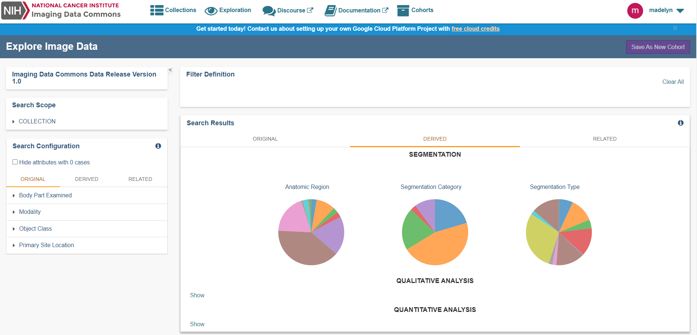

# Exploring imaging data

The Imaging Data Commons Portal user interface has four components to support exploration of Imaging data; a **Search Scope** panel, a **Filter Definition** panel, a **Search Configuration** panel, and a **Collections** panel.

Below you will find more details regarding our four primary search panels available:

You can explore IDC data and metadata by selecting filters in the **Search Scope** and **Search Configuration** panels on the IDC portal home page. Selecting filters narrows down the available image series to meet your criteria. You can then save your filter selection as a [cohort ](./#understanding-cohorts)for later use.

* **Search Scope panel:** The Search Scope panel is primarily used to filter by collection. We currently have 20+ collection options present.
* **Search Configuration panel:** The Search Configuration panel is the more detailed attribute filter option by utilizing various case, Segmentation, Qualitative, and Quantitative Analyses.
* **Search Results panel:** The Search Results is the visual representation panel of the detailed attribute filter options we have available in the form of pie charts.
*   **Collections panel:** The Collections panel can be used to view a Selected Study and/or a Specific Series without any additional attribute option selected.

    We will cover more in more detail all the attribute options we have available within the Search Configuration panel and the Search Results panel.

The pie charts in the Search Results panel show the number of cases (or patients) in your search results by Anatomical Region, Segmentation Category, and Segmentation Type. Hover over a pie slice to see the name of the Anatomical Region, Segmentation Category, and Segmentation Type, number of each, and percent of the total in your search results.

You can also explore the IDC data without filters. If you want to view a collection's cases, studies, and series, scroll down the IDC portal home page until you reach the Collections panel. Click any link on the Collections panel to view available data about your selection in tabular form in the _Filter Definition_, _Selected Cases_, _Selected Studies_, and _Selected Series_ panels.


Log in to the portal to [save your filter selections as a cohort](./#creating-a-cohort).


 (2) (2) (2) (2) (4) (4) (4) (2) (4) (4) (1) (1) (1) (1) (1) (1) (1) (1) (1).png>)

## **Defining search scope and configuration**

Do the following to define the scope and configuration of your search.

1. In the Search Scope panel, click **COLLECTION** to view the collections in the portal.
2. Click the box to the left of a collection name to select one or more collections. You can hover over a collection name to view more information about the collection.
3. In the Search Configuration panel, select filters on the **Original**, **Derived**, and **Related** tabs to narrow down the available image series. Click any of the filter names on these tabs to view and select the available options. Attribute filter selections in the Search Configuration panel that have no data available are highlighted in grey. Optionally, hide attributes with 0 cases by selecting the checkbox at the top of the panel. The following table describes each of the tabs in this panel.

| Tab          | Description                                                                                                                                                                                                                                                                                                                                                                                                                                                                                                                                                                                                                                                                                                                                                                                                                                                                                                                                    |
| ------------ | ---------------------------------------------------------------------------------------------------------------------------------------------------------------------------------------------------------------------------------------------------------------------------------------------------------------------------------------------------------------------------------------------------------------------------------------------------------------------------------------------------------------------------------------------------------------------------------------------------------------------------------------------------------------------------------------------------------------------------------------------------------------------------------------------------------------------------------------------------------------------------------------------------------------------------------------------- |
| **Original** | 
This attribute set has been built by DICOM objects that were produced by image acquisition equipment (e.g., MR, CT or PET images). This tab also includes groups of attributes that are common across all DICOM objects, for example, Modality.  For more information, see <a href="../../dicom/original-vs-derived-objects.md">Original data</a>.
                                                                                                                                                                                                                                                                                                                                                                                                                                                                                                                                                                                |
| **Derived**  | 
You can filter all analyzed and post processed data with Derived attributes. Over 25 attribute filter options are available.

For more information see, <a href="../../dicom/derived-objects.md">Derived data</a>.

The IDC portal organizes attributes of derived objects into the following categories, which were chosen because of the content of the derived objects available in IDC:
<ul><li><strong>Segmentations:</strong> volumetric annotations of the image regions stored as DICOM Segmentation objects</li><li><strong>Qualitative Analysis:</strong> Qualitative evaluation results (e.g., scores or categories associated with image findings) stored in DICOM Structured Reporting TID1500 objects</li><li><strong>Quantitative Analysis:</strong> Quantitative evaluation results (e.g., scores or categories associated with image findings) stored in DICOM Structured Reporting TID1500 objects</li></ul> |
| **Related**  | 
<a href="https://www.cancer.gov/about-nci/organization/ccg/research/structural-genomics/tcga">The Cancer Genome Atlas</a> collections have a rich filter selection for clinical data associated with imaging data. This filter set is useful when working primarily with the TCGA collections.

Filter attributes in this tab only filter cases within the TCGA collections. Other collections are not affected by these filters.

The organization of the TCGA related data is described in detail in the <a href="https://isb-cancer-genomics-cloud.readthedocs.io/en/latest/sections/BigQuery/ISBCGC-BQ-Projects.html">ISB-CGC documentation</a>.
                                                                                                                                                                                                                                                                          |

## Understanding counts in the search results

The Imaging Data Commons hosts multiple nuances of non-mutually exclusive attributes. This may mean that attributes you did not select appear in your search results. You may want to take this into consideration when analyzing the data in your search results.

On the Search Configuration panel, the number of unique cases (or patients) for each attribute within a cohort is constructed by adding the given attribute (when absent) to the defined filter.

On the Search Results panel, each pie chart reports the number of cases (or patients) for all values within a given attribute, given the currently defined filter set. Once you select a case, instances that both meet and do not meet the search criteria corresponding to this case affect the charts' content. As an example, cases selected based on the presence of CT modality may also contain PET modality, counts of which for that given case also appear in the chart summary.
