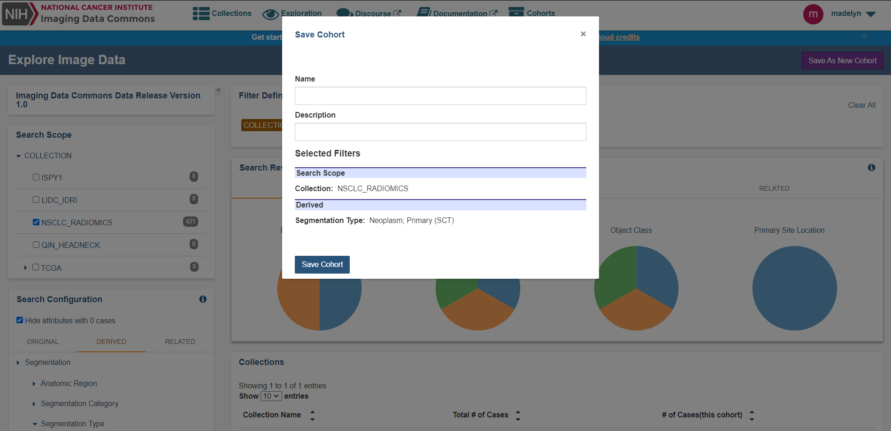
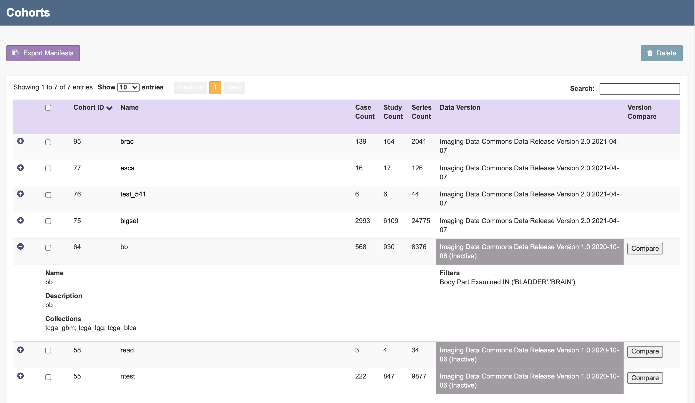
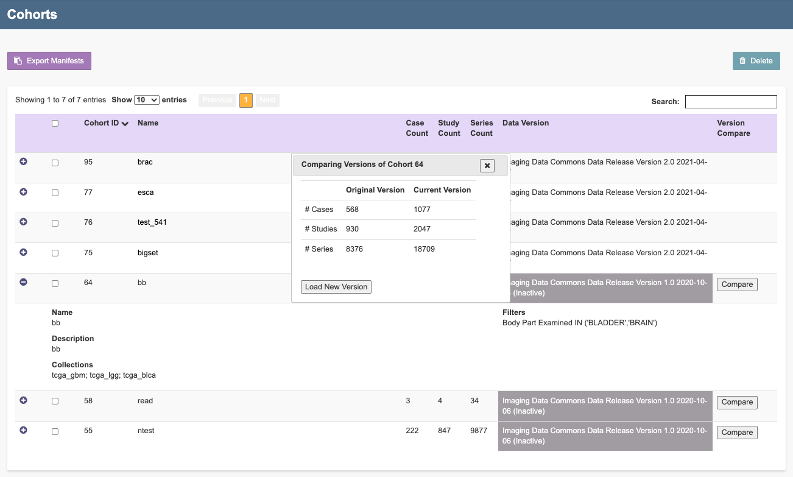

# Understanding cohorts

Creating a cohort helps you quickly return to a subset of interest from the vast collection of data available in the Imaging Data Commons. A cohort is composed of your selections in the Search Scope and Search Configuration panels.

## Creating a cohort

Do the following to create a cohort.

1. [Select filters](./#defining-search-scope-and-configuration) on the Search Scope and Search Configuration panels.
2. Click the **Save As New Cohort** button in the top-right of the portal.

   The Save Cohort dialog box appears, showing your selected filters.

3. Enter a name for the cohort. Optionally, enter a description.
4. Click **Save Cohort**.  The cohort details page appears.

The cohort details page shows the cohort name, description \(if available\), and filter definition.

You can open any study or series associated with the cohort using the IDC Viewer. For more information on image visualization, see [Visualizing images](../visualization.md).

## **Accessing the cohort m**anifest

The cohort manifest identifies the sources of data in your cohort and allows you to download this data. You can export a cohort manifest to CSV, TSV, and JSON formats, and to BigQuery.


You can download cohorts of up to 650,000 rows as a multipart file, with each file having a limit of 65,000 rows. Access cohorts larger that 650,000 rows by exporting to BigQuery.


**To export the cohort manifest**

1. [Create a cohort](./#creating-a-cohort) or click **Cohorts** on the top menu bar \_\*\*\_and select a cohort you previously created.
2. Click the **Export Cohort Manifest** button. The Export Cohort Manifest dialog box appears.
3. Select the [header fields and columns](./#header-fields-and-column-selection) you want to appear in the export file.
4. Select whether you want to export the cohort as files or using [BigQuery](./#exporting-the-cohort-manifest-to-bigquery).
   * If you want to download the cohort as CSV or TSV files, select **Include header fields** if you want this data in the export file.
   * Select which format the files in the export should be by clicking **Download CSV**, **Download TSV**, or **Download JSON**.
   * If you want to download the cohort using BigQuery, click **Get BQ Table.**

## Understanding the cohort manifest

The header of the manifest contains the name of cohort, user, filters used, the date generated, and the total number of records. Data is separated by multiple files until the limit of 65,000 files is reached. If your data set is larger than this, you must export it using BigQuery.

The default fields provided in a cohort are:

* `PatientID`: value of the corresponding DICOM attribute
* `collection_id`: abbreviated identifier of the source data collection 
* `StudyInstanceUID`: value of the corresponding DICOM attribute
* `SeriesInstanceUID`: value of the corresponding DICOM attribute
* `SOPInstanceUID`: value of the corresponding DICOM attribute
* `source_DOI`: Digital Object Identifier \(DOI\) of the source data collection. Pre-pending `source_DOI` with `https://doi.org/` will give you the URL of the collection dataset
* `crdc_instance_uid`: unique identifier of the object maintained by CRDC IndexD \(details on how to use this UID will be shared at a later time, when the corresponding capability is available\)
* `gcs_url`: `gs://` URL that can be used to access the object using the [GCP `gsutil` tool](https://cloud.google.com/storage/docs/gsutil)

An example of how you can use an IDC cohort manifest to retrieve the manifest-defined cohort files is shown in [colab notebooks](https://github.com/ImagingDataCommons/IDC-Examples/tree/master/notebooks).


A multipart file export can have a maximum of ten files with 65,000 rows each. If your export is larger than this, you must export the manifest via BigQuery.


## Exporting to BigQuery


You must have a Google account to use BigQuery.


Exporting a manifest to BigQuery allows you to run complex, analytical, SQL-based queries on large sets of data. The export table is available for seven days. After you start the export, the following window appears on the cohort details page, showing your unique link.


Be sure to save this URL information or pin the BigQuery table to your Google console interface.


After the export table expires, you can create a new manifest for analysis.

## **Exporting as a file**

Comma-Separated Values \(CSV\) and Tab-Separated Values \(TSV\) files include header fields, so you can customize which of those fields you want to include in the export. You can also select which columns to include in the file.

On the cohort manifest export confirmation window, you can select or clear header fields that you want to appear in your export.

JSON files do not include any header information but like CSV and TSV files, require that you identify which columns to include in your export. You can import the JSON file to a BigQuery table for further analysis.


You must select a column option to export the cohort manifest.


## Viewing the cohorts list

Click the **Cohorts** button in the header to view a list of all the cohorts you created under your account. Each row in the cohorts list includes the corresponding cohort ID, name, the number of cases, studies, and series in the cohort, and the version of the IDC data against which the cohort was created. Pressing the **plus** icon on any row in the cohort list opens a second related row that provides information about the cohort's collections and filters.

Cohort manifests can be exported directly from the **Cohorts** page. Click the checkboxes corresponding to the desired cohorts, then click the **Export Manifest** button which opens the Export Cohort Manifest dialog box discussed [above.](https://learn.canceridc.dev/portal/data-exploration-and-cohorts/#accessing-the-cohort-manifest) Complete this dialog box to export separate manifests for all selected cohorts. Note that only a single cohort manifest can be exported to a file download at one time. Also cohorts with inactive data versions cannot be downloaded to a file. When multiple manifests are exported to BigQuery they are copied to separate BigQuery tables. One or more cohorts can be deleted by clicking the relevant checkboxes and then clicking the **Delete** button.

## Cohort Versions

To indicate cohorts created with previous data versions in the cohort list the **Data Version** cells of such cohorts will have a grey background. The cohort manifest remains accessible for all cohorts after the active data version changes. However cohorts created with older data versions can no longer be opened within the portal. Clicking on the button in the **Version Compare** cell in the cohort list opens a pop-up window that compares the number of cases, studies, and series in the current cohort with those of a new cohort that would be created by applying the cohort's filters to the current data set.

Clicking on the **Load New Version** button will open the explorer page, applying these cohort filters to the current data version. The user can then save this new cohort or modify the filters as desired.

