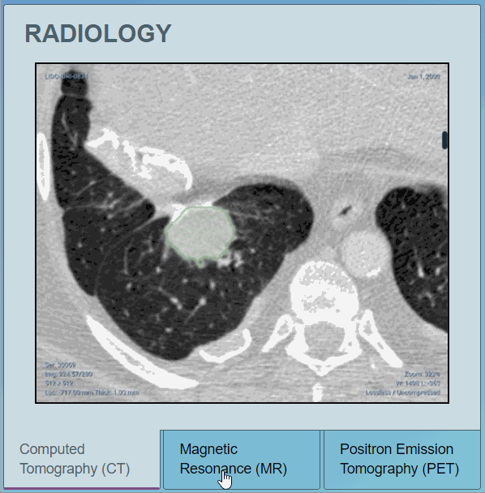
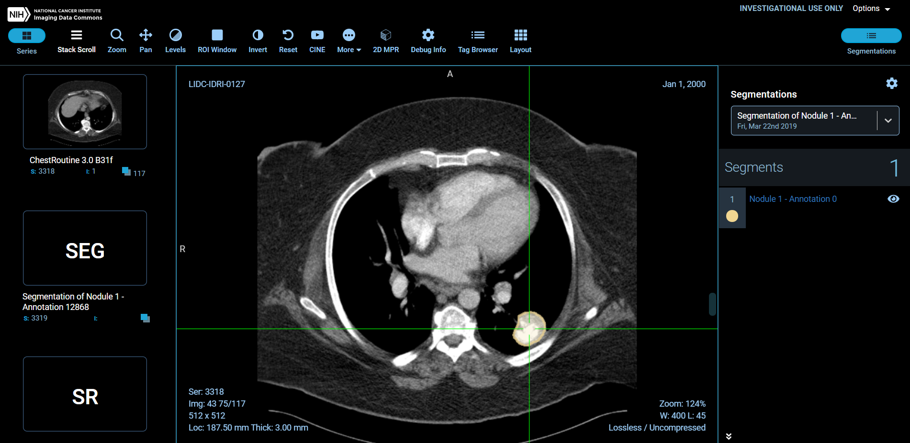

# Image Visualization

## Open Health Imaging Foundation \(OHIF\)

We currently highlight the Open Health Imaging Foundation\(OHIF\) as our main tool for visualization of images. 

The ability to promote, filter, and load multiple series instances is now live and available at the Imaging Data Commons. 

## Segmentations

OHIF provides extensive support for viewing, annotating, and reporting on DICOM images in 2D \(slices\) and 3D \(volumes\).


Segmentations and Real World Value Mapping object classes can only be viewed at the Study level.


Below is an example of series objects that are only available at the Study level. 

For the series unavailable, the view option will be disabled and you will see a notification stating, "Please open at the study level to see this series".

## 2D MPR \(2D Multiplanar Reconstruction\) 

The MPR tool provided within the OHIF viewer can be used to reconstruct images in orthogonal planes \(coronal, sagittal, axial or oblique, depending on what the base image plane is\).

Key features include the ability you use crosshairs, adjust contrast, rotate the series, adjust thickness, and send easily send an email for debugging in case of an error. 

Additionally, all tagged browser information needed is easily available. We provide the **Tag**, **Value Representation**, **Keyword**, and **Value** for each instance in the view.

A key functionality available is the ability to adjust the Slab Thickness. The thickness can be adjusted from 0.1mm - 1,000 mm. 

## RT Structure Sets \(Radiotherapy structure set\)

RT Structure Sets have set the standard for integration of radiation therapy information that facilitates interoperability between different radiation therapy systems, thus making possible the sharing of information from different systems.

